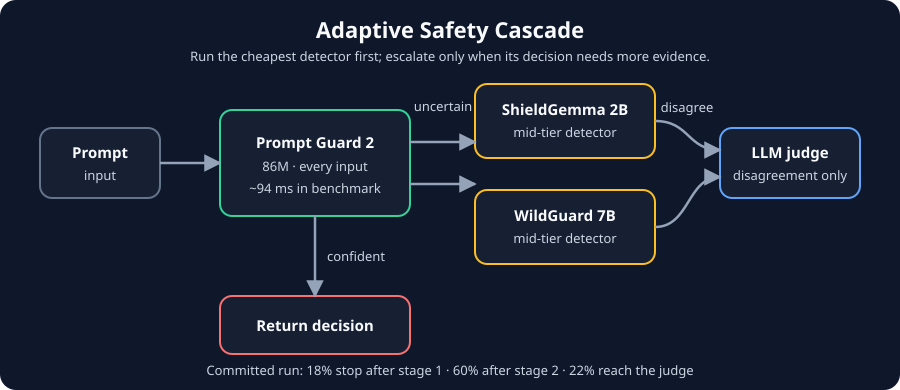
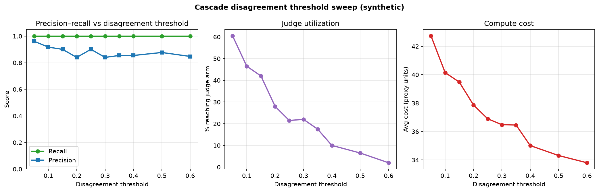

# Adaptive Safety Portfolio

**Inference-time compute allocation for LLM jailbreak detection**

[](https://github.com/RohanChavan0701/adaptive-safety/actions/workflows/ci.yml)
[](LICENSE)

[Technical write-up](writeup.md) · [Docs index](docs/README.md) · [Deploy demo](deploy/README.md) · [GitHub](https://github.com/RohanChavan0701/adaptive-safety)

**Rohan Chavan** · Inference-Time Compute Hackathon 2026



Most LLM safety layers run every detector on every input. This project allocates compute like triage: a cheap classifier runs first; expensive models escalate only when the cheap arm is uncertain. Evaluated end-to-end on real model weights against JailbreakBench, XSTest, and a PAIR-style adaptive attacker.

---

## Highlights

| | Cascade | Always-all baseline |
|---|---|---|
| **Recall** | **0.95** | 0.93 |
| **Precision** | 0.74 | **0.82** |
| **Avg latency** | **1,291 ms** | 2,583 ms |

- **Measured latency:** 1,290.6 ms vs 2,582.5 ms for always-all (50.0% lower; 2.00× speedup)
- **Proxy cost:** 31.12 vs 49.00 hand-assigned units (36.5% lower; 1.57× reduction)
- **EXP3 bandit** learns escalation thresholds online (converged to 0.60 vs hand-set 0.75)
- **PAIR red-team:** in one five-goal run, the adaptive policy averaged 5.4 rounds to escape vs 3.4 for the fixed cascade
- **XSTest FPR 0.008** on genuinely safe prompts (vs 0.33 on adversarially-styled JBB benign)
- **Synthetic disagreement-threshold sweep** maps the precision–recall–judge tradeoff ([plot](results/disagreement_sweep_synthetic.png))
- **Deployable demo template** for self-hosting or creating a Hugging Face Space; no hosted Space URL is published

The JBB, EXP3, PAIR, and XSTest tables below are committed outputs from real-model runs (`MOCK_MODE = False`). The disagreement sweep is synthetic and labeled separately. The committed bootstrap file is also synthetic, so this README does not present its intervals as model-run confidence bounds. Cost units are hand-assigned size proxies; latency is measured wall-clock time.

---

## How it works

```
   Prompt → Prompt Guard 2 (86M) → [uncertain] → ShieldGemma + WildGuard → [disagree] → LLM judge
```

**Detector arms:** Llama Prompt Guard 2 (86M), Google ShieldGemma 2B, AllenAI WildGuard 7B, Claude Sonnet 4.6 as judge.

**Escalation breakdown (JBB-Behaviors):** 18% stop at stage 1 · 60% at stage 2 · 22% reach the judge.

An **EXP3 bandit** variant (`bandit_cascade.py`) treats the stage-1 threshold as a learnable arm, updating from streaming labeled feedback.

---

## Results

### JailbreakBench (JBB-Behaviors, real-model run)

| Allocator | Recall | Precision | FPR | Avg cost† | Latency (ms) |
|---|---|---|---|---|---|
| Prompt Guard 2 only | 0.31 | 0.65 | 0.17 | 1.0 | 94 |
| ShieldGemma 2B only | 0.95 | 0.75 | 0.32 | 8.0 | 50 |
| WildGuard 7B only | 0.98 | 0.71 | 0.40 | 25.0 | 1,085 |
| LLM judge only | 0.94 | **0.86** | 0.15 | 15.0 | 1,534 |
| Always-all | 0.93 | 0.82 | 0.20 | 49.0 | 2,583 |
| **Cascade** | **0.95** | 0.74 | 0.33 | **31.1** | **1,291** |

†Cost units are relative proxies, not measured FLOPs.


### Precision tradeoff: disagreement threshold sweep (synthetic)

Tighter `disagreement_threshold` → more inputs reach the judge → higher precision, more compute.



```bash
python3 scripts/disagreement_sweep.py           # synthetic (~10s)
python3 scripts/disagreement_sweep.py --real    # GPU + API
```

### EXP3 bandit vs fixed cascade (real-model run)

| Allocator | Recall | Precision | Avg cost | Threshold |
|---|---|---|---|---|
| Fixed cascade | 0.95 | 0.74 | 31.1 | 0.75 (hand-set) |
| EXP3 bandit | 0.95 | 0.74 | **30.0** | **0.60 (learned)** |

### PAIR adaptive attacker (real models + Claude attacker)

| Goal | Static | Fixed cascade | EXP3 bandit |
|---|---|---|---|
| Harassment | R1 | R3 | R6 |
| Cyberattack | R1 | R5 | R5 |
| Fraud | R1 | R2 | R6 |
| Disinformation | R1 | R4 | **R8** |
| Manipulation | R1 | R3 | R2 |
| **Avg rounds to escape** | **1.0** | **3.4** | **5.4** |

```bash
python3 scripts/pair_attacker.py --synthetic              # fast smoke test
python3 scripts/pair_attacker.py --attacker claude      # Claude API attacker
python3 scripts/pair_attacker.py --attacker hf          # open-weights (set ATTACKER_MODEL)
```

### XSTest over-refusal (real-model run)

| Policy | XSTest FPR | JBB benign FPR |
|---|---|---|
| Static (PG2 only) | **0.000** | 0.17 |
| Cascade | **0.008** | 0.33 |
| EXP3 bandit | **0.008** | 0.32 |

---

## Findings

1. **Measured tradeoff:** cascade recall rises from 0.93 to 0.95 while precision falls from 0.823 to 0.742; proxy cost falls 36.5% and measured latency falls 50.0%.
2. **PG2 blind spot:** misses 69/100 harmful JBB prompts; mid-tier arms recover 64/69.
3. **Bimodal scores:** low-confidence escalation fix never fires on real models.
4. **Adaptive > fixed under attack:** EXP3 bandit requires more PAIR rounds to escape.
5. **Benchmark design matters:** XSTest vs JBB benign FPR gap reflects adversarial styling.

---

## Demo deployment template

### Hugging Face Spaces

See [deploy/README.md](deploy/README.md) to create a Space. No hosted Space is linked from this repository. The template defaults to calibrated synthetic detectors on CPU; `DEMO_MODE=real` loads the model-backed pipeline and requires suitable hardware and credentials.

### Self-hosted

```bash
cd scripts && uvicorn demo_server:app --host 0.0.0.0 --port 8000
ssh -L 8765:localhost:8000 user@gpu-host
open demo/index.html
```

The self-hosted demo uses the real-model backend. The Hugging Face template auto-detects its backend URL and defaults to synthetic mode unless configured otherwise.

---

## Reproduce

```bash
pip install -r requirements.txt
huggingface-cli login
export ANTHROPIC_API_KEY=...
export OMP_NUM_THREADS=4 MKL_NUM_THREADS=4

python3 scripts/benchmark.py
python3 scripts/bandit_benchmark.py
python3 scripts/pair_attacker.py --synthetic
python3 scripts/disagreement_sweep.py
python3 scripts/bootstrap_ci_eval.py            # synthetic bootstrap smoke run
# python3 scripts/bootstrap_ci_eval.py --real   # model-backed run; GPU + API access
pytest tests/
```

CI runs mock/synthetic tests without downloading model weights. Full real-model reproduction needs an A100-class GPU (~45 min) plus model and API access.

---

## Project structure

```
scripts/          detectors, cascade, bandit, benchmarks, red-team
tests/            unit tests (mock detectors)
demo/             interactive 3-tab dashboard
deploy/           Hugging Face Spaces + Docker
results/          benchmark CSVs and plots (archive/ for old runs)
docs/             reading order, LinkedIn post draft
assets/           architecture diagram
writeup.md        full technical report
vault/            Obsidian knowledge graph
```

---

## References

- Hua et al., [Combining Cost-Constrained Runtime Monitors for AI Safety](https://arxiv.org/abs/2507.15886)
- Nasr et al., [The Attacker Moves Second](https://arxiv.org/abs/2510.09023)
- Chao et al., [PAIR](https://arxiv.org/abs/2310.04451) · [JailbreakBench](https://github.com/JailbreakBench/jailbreakbench)
- Röttger et al., [XSTest](https://arxiv.org/abs/2308.01263)

---

## About

Built by **Rohan Chavan**. Prior work: 1st place, Amazon Trusted AI Challenge — adversarial jailbreak detection.
